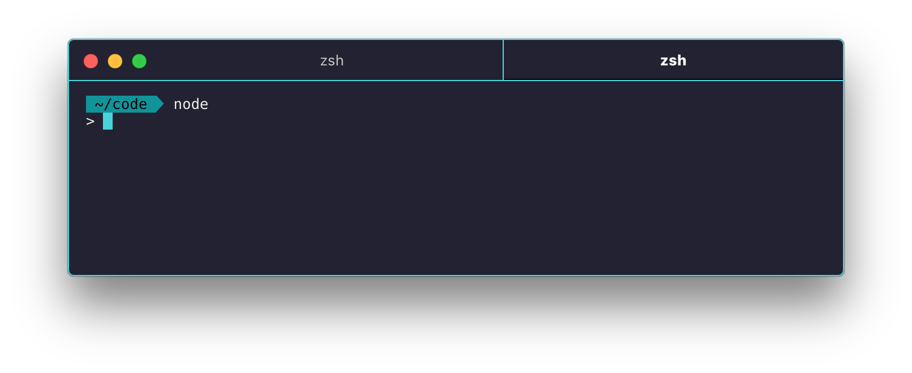

# hyperterm-bold-tab [![NPM version][npm-image]][npm-url]

> [HyperTerm](https://hyperterm.org) enhancement to bold your current tab text

 

## Install

Add `hyperterm-bold-tab` to the plugins list in your `~/.hyperterm.js` config file.

 

## License

MIT © [Dawson Botsford](http://dawsonbotsford.com)

[npm-image]: https://badge.fury.io/js/hyperterm-bold-tab.svg
[npm-url]: https://npmjs.org/package/hyperterm-bold-tab
